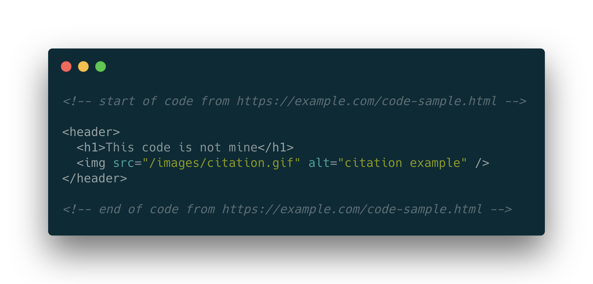
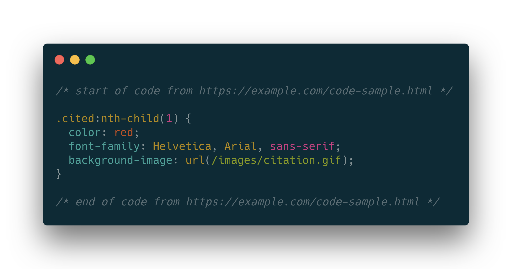
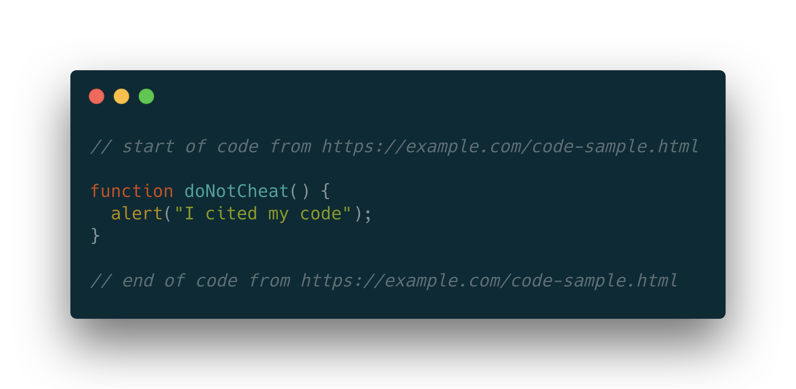

# Citing Code

Pablo Picasso once said "Good artists copy, great artists steal." More to the point for our class, Cameron Moll rephrased it—"Good Designers Copy, Great Designers Steal"

A great way to learn design and code is to look under the hood of a website to see how it was made. With a click of the mouse, we can inspect the code and see exactly what the designers and developers did to create the look/effect/design before us. We can even copy that code and paste it into our code editor to manipulate it and make it do what we want for our site. 

To a degree, there is nothing wrong with _'borrowing code'_—we all borrow great ideas from others. Think about the last essay you wrote; you probably put a quote in there because you thought "Dang! That person said it so perfectly!" You didn't come up with is, but you used it. And you quoted it (and cited it). 

When we code, we should cite the source we used, just like any essay we might hand in for grading.

## When should I cite a source in my code?

- Any time you copy code from an external source. Whether you are copying a snippet of code or a big chunk, you should credit the source.
- When you copy the code and adapt it, you should still credit the source. You were _not_ the original developer of the code.

## How should I cite the code?

### HTML

	<!-- start of code from https://example.com/code.html -->
	
	<header>
		<h1>This code is not mine</h1>
		
	
		<!-- end of code from https://example.com/code.html -->

### CSS

		/* start of code from https://example.com/code.html  */
		
		.cited:nth-child(1) {
			color: red;
			font-family: Helvetica, Arial, sans-serif;
			background-image: url(/images/citation.gif);
		}
		
			/* end of code from https://example.com/code.html */

### Javascript

	// start of code from https://example.com/code.html 
	function doNotCheat() {
	    alert("I cited my code");
	}
	
	// end of code from https://example.com/code.html
	

List _all_ code sources and the sources of any images that are not your own in a PDF file submitted to Slate along with your assignment.

Even if you do not copy the code verbatim, you must still cite where concepts/references came from. Indicate “Adapted from:” or “Based on” so it is understood that you made changes to the original code.

If you use Open Source code or public libraries, you should still properly cite the source and follow the terms of any licensing that applies to the code you are using. 

## Pro Tips

Although it is common practice to adapt code examples found on the web,

- You should never copy code from other students. Your peers are not considered an authorized source.
- You do not need to cite things taught during class—I gave you the code and recognize it as mine :)
- You should not simply re-use code as the solution to an assignment. Like academic writing, your code can incorporate the ideas of others but should reflect your original approach to the problem. Imagine taking an essay from another author and wrapping it quotes and saying it was yours—would that fly with your history teacher? Nope! Same thing in this class.
- When in doubt—cite! To be even safer, ask Ryan before an assignment is due if what your'e doing is right or acceptable. 

For more information on Academic Integrity, visit [Academic Integrity for Students](https://sheridancollege.libguides.com/AI_students/avoid)

_Some content adapted from https://integrity.mit.edu/handbook/writing-code_

